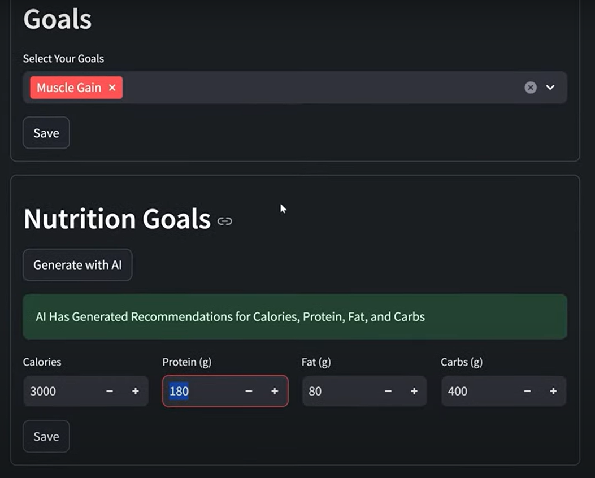

# Advanced Multi-Agent Workout App
## Overview
---
An AI-powered workout assistant built with multi-agent systems.
This app helps users plan, track, and optimize workouts using LLMs, RAG, and visual AI flows.

## Features
---
- Multi-Agent System – specialized AI agents for workouts, diet, and tracking

- Streamlit Frontend – clean UI to interact with agents

- Langflow Integration – low-code visual editor to design & manage AI workflows

- RAG (Retrieval-Augmented Generation) – powered by Astra DB vector database

- Personalized recommendations from user profiles

- Local + cloud storage for progress tracking

 ## Installation
---
1. Clone the repo
```
git clone https://github.com/Vaishnavi-Verma-21/Multi-Agent-Workout-App.git
cd Advanced-Multi-Agent-Workout-App
```

2. Create virtual environment
```
python -m venv venv
source venv/bin/activate   # Mac/Linux
venv\Scripts\activate      # Windows
```

3. Install dependencies
```
pip install -r requirements.txt
```

4. Set up environment variables

- Copy sample.env → .env

- Add your keys/configs for:

  - Astra DB

  - Langflow API

  - Any LLM provider keys

5. Run the Streamlit app
```
streamlit run main.py
```
## Tech Stack
---
Python → Core coding & backend logic

Streamlit → Frontend + LLM handling

Langflow → Visual AI flow builder (low-code)

Astra DB → Vector database for RAG implementation

## Workout App
---


### AI Generated recommendation for Calories, Protein, Fat and Carbs (Default is set to 2000 calories, 140 Protein, 20 Fat and 100 Carbs)
---




### Addition of notes
---


### General question asked from AI
---


